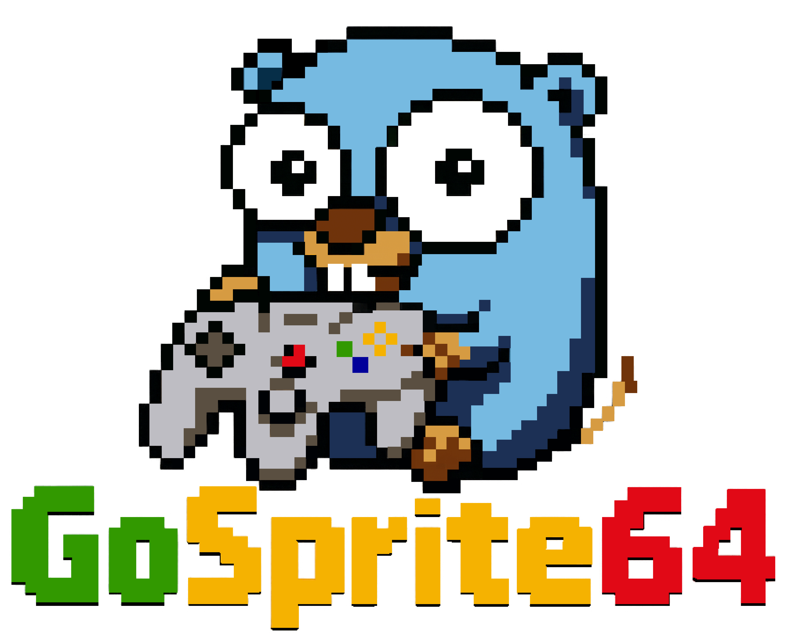

<h1 align="center" style="border-bottom: none">
     GoSprite64
</h1>

a 2D retro gamedev library for Nintendo64 using Go!

[![License][License-Image]][License-Url]
[![CI][CI-Image]][CI-URL]

[![Publish docs][Doc-Image]][Doc-URL]
[![Dependabot Updates][Dependabot-Image]][Dependabot-URL]

visit <a href="https://gosprite64.dev" target="_blank">gosprite64.dev</a> for the full documentation,
examples and guides.

## Quick Start

GoSprite64 supports one setup path:

1. Install `go1.24.5-embedded`
2. Install `n64go@v0.1.2`
3. Run `./build_examples.sh`

The repository tracks toolchain settings in `n64.env`, and `./build_examples.sh` is the primary entrypoint for building the examples.

For the full setup details read [`docs/getting_started.md`](./docs/getting_started.md).

If `Cursor` or `VS Code` shows false `embedded/*` import errors or ignores `//go:build n64` files, see the editor setup note in [`docs/getting_started.md`](./docs/getting_started.md).

## Rendering Model

GoSprite64 exposes one official fixed resolution and drawing canvas: `288x216` logical pixels.

That is the supported public rendering contract. The runtime centers the canvas inside the internal framebuffer and presents it for you with square pixels, so game code should treat `gosprite64.FillRect`, `gosprite64.DrawRect`, `gosprite64.DrawLine`, and `gosprite64.DrawText` as logical-coordinate APIs. You do not need to manage borders, safe areas, or video-mode presets yourself.

If you want a visual sanity check after building the examples, start with `examples/calibration`.

## ✨ Features

GoSprite64 embraces the flat world of tilemaps, palettes, and pixel-art game scenes without the complexity of 3D pipelines.

> "You only need X and Y."

* 🕹️ Built on [embedded-go](https://github.com/embeddedgo/go) to provide Go idiomatic experience.

* 🎮 Powered by [clktmr/n64](https://github.com/clktmr/n64) to make things possible directly on real N64 hardware.

* 🧠 Clean and idiomatic Go API inspired from [Ebitengine](https://ebitengine.org/), [Raylib](https://www.raylib.com/) and [PICO-8](https://www.lexaloffle.com/pico-8.php)

* 🗺️ Tile2D scene pipeline: author tile sheets and maps offline, bundle them, load and render at runtime with camera scrolling

* 🔊 VADPCM audio pipeline: compress WAV files at build time, play sound effects and music at runtime with zero per-frame allocations

* 💾 Runs on real N64 consoles (via [EverDrive](https://krikzz.com/our-products/cartridges/ed64x7.html) or [SummerCard64](https://summercart64.dev/))

* 🔧 Great for retro homebrew, demoscene, or nostalgic experiments

## Contributing

If you are interested in contributing to GoSprite64, read about our [Contributing guide](./CONTRIBUTING.md)

## License

This project is licensed under the MIT license. See the [LICENSE](LICENSE) file for details.

[License-Url]: https://mit-license.org/
[License-Image]: https://img.shields.io/badge/License-MIT-blue.svg
[CI-URL]: https://github.com/drpaneas/gosprite64/actions/workflows/ci.yml
[CI-Image]: https://github.com/drpaneas/gosprite64/actions/workflows/ci.yml/badge.svg
[Dependabot-URL]: https://github.com/drpaneas/gosprite64/actions/workflows/dependabot/dependabot-updates
[Dependabot-Image]: https://github.com/drpaneas/gosprite64/actions/workflows/dependabot/dependabot-updates/badge.svg
[Doc-URL]: https://github.com/drpaneas/gosprite64/actions/workflows/mdbook.yml
[Doc-Image]: https://github.com/drpaneas/gosprite64/actions/workflows/mdbook.yml/badge.svg
