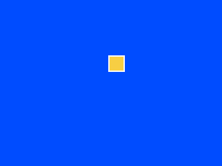

# Make Something Move

## What you are about to achieve

Make a shape move across the screen so `Update()` becomes visible, not theoretical.

## Expected result



## Minimal code

You are still working in `examples/clearscreen/`. Keep editing `examples/clearscreen/main.go` and keep rebuilding the same ROM from the previous steps.

This step replaces the full red screen from the previous page with a blue background and one moving yellow box.

```go
type Game struct {
	x int
}

func (g *Game) Init() {}

func (g *Game) Update() {
	g.x++
	if g.x > 287 {
		g.x = -24
	}
}

func (g *Game) Draw() {
	gosprite64.ClearScreenWith(gosprite64.Blue)
	gosprite64.FillRect(g.x, 80, g.x+23, 103, gosprite64.Yellow)
}
```

Replace the `Game` type and methods in `examples/clearscreen/main.go` with the version above.

From the repository root, rebuild the ROM:

```bash
./build_examples.sh
```

Then reopen `examples/clearscreen/game.z64`.

## What changed

The `Update()` method now changes state every frame, wraps the box back to the left after it crosses the screen, and `Draw()` uses those values as the rectangle corners for one 24x24 box.

## Why it matters

This is the first time the learner sees the game loop as behavior, not vocabulary.

## If this failed

If the shape never moves, confirm that the `g.x++` and wrap check are both inside `Update()`, that `FillRect` uses the bottom-right corner instead of width and height values, and that you saved `examples/clearscreen/main.go`, ran `./build_examples.sh` from the repository root, and reopened `examples/clearscreen/game.z64`.

## Next step

Go to [Put a Sprite on Screen](./04-put-a-sprite-on-screen.md).
