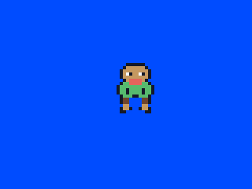
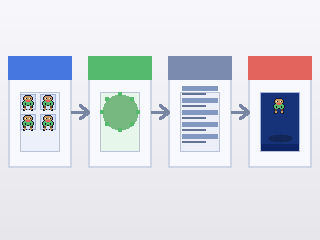

# Put a Sprite on Screen

## What you are about to achieve

Replace the moving box with a real sprite and understand the smallest useful version of the asset pipeline.

## Expected result



## How the asset flows



Stay in `examples/clearscreen/`. In this step you will keep editing `examples/clearscreen/main.go`, add `examples/clearscreen/assets_embed.go`, and run the asset-generation command from inside `examples/clearscreen/`.

## Minimal files

In `examples/clearscreen/main.go`, replace the moving box version with:

```go
type Game struct {
	x    float32
	hero *gosprite64.SpriteSheet
}

func (g *Game) Init() {
	g.x = 144

	hero, err := gosprite64.LoadSpriteSheet("assets/hero.sheet")
	if err != nil {
		panic(err)
	}
	g.hero = hero
}

func (g *Game) Update() {
	g.x += 1
	if g.x > 287 {
		g.x = -16
	}
}

func (g *Game) Draw() {
	gosprite64.ClearScreenWith(gosprite64.Blue)
	gosprite64.DrawSprite(g.hero, 0, g.x, 80)
}
```

Add `examples/clearscreen/assets_embed.go` so the ROM can load files from `examples/clearscreen/assets/`:

```go
package main

import (
	"embed"

	"github.com/clktmr/n64/drivers/cartfs"
	"github.com/drpaneas/gosprite64"
)

//go:embed assets/*
var assetsFS embed.FS

var assetFS = cartfs.Embed(assetsFS)

func init() {
	gosprite64.RegisterAssetFS(assetFS)
}
```

Then put a 64x16 PNG strip at `examples/clearscreen/assets-src/character.png`. If you are following along inside this repository, a good checked-in example is `examples/platformer/assets-src/character.png`.

From inside `examples/clearscreen/`, run:

```bash
mkdir -p assets assets-src
go run ../../cmd/mk2dsheet \
  -in assets-src/character.png \
  -out assets/hero.sheet \
  -tile-width 16 -tile-height 16
```

That command writes `examples/clearscreen/assets/hero.sheet`, which `assets_embed.go` registers and `main.go` loads once in `Init()`.

If you are currently in the repository root, run `cd examples/clearscreen` first, then use the command above.

When the asset file is ready, go back to the repository root and rebuild the ROM:

```bash
cd ../..
./build_examples.sh
```

Then reopen `examples/clearscreen/game.z64`.

## What changed

You stopped drawing a placeholder rectangle and started drawing image-based content loaded once during setup, with a clean screen each frame before the sprite is drawn. The sprite also wraps back to the left so it stays visible instead of drifting away forever.

## Why it matters

This is the point where the project starts to feel like a game instead of a rendering demo.

## If this failed

Double-check that `assets-src/character.png` exists before you run `mk2dsheet`, make sure `assets/hero.sheet` was created inside `examples/clearscreen/assets/`, confirm that `assets_embed.go` uses `cartfs.Embed(...)` before `gosprite64.RegisterAssetFS(...)`, and make sure the wrap check stays inside `Update()` so the sprite remains visible.

Need the full sprite-sheet pipeline and more examples? Go to [Sprites](../05-graphics/sprites.md).

## Next step

Go to [Build a Tiny Playable Scene](./05-build-a-tiny-playable-scene.md).
