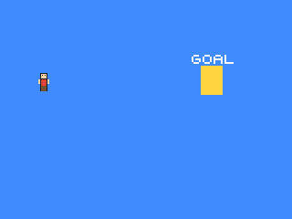

# Build a Tiny Playable Scene

## What you are about to achieve

Turn the moving sprite into a tiny scene the player can control. Instead of drifting on its own, your character can move left and right and reach a simple goal.

## Expected result



## Minimal code

Stay in `examples/clearscreen/`. Keep `examples/clearscreen/assets_embed.go` from the previous step unchanged, and continue editing `examples/clearscreen/main.go`.

Keep the `Init()` from the previous step that loads `assets/hero.sheet`, but start farther left so the player has somewhere to move from:

```go
func (g *Game) Init() {
	g.x = 40

	hero, err := gosprite64.LoadSpriteSheet("assets/hero.sheet")
	if err != nil {
		panic(err)
	}
	g.hero = hero
}
```

Then replace the automatic movement with player input and draw a visible goal:

```go
func (g *Game) Update() {
	if gosprite64.IsButtonDown(gosprite64.ButtonDPadLeft) {
		g.x -= 2
	}
	if gosprite64.IsButtonDown(gosprite64.ButtonDPadRight) {
		g.x += 2
	}
}

func (g *Game) Draw() {
	gosprite64.ClearScreenWith(gosprite64.Blue)
	gosprite64.FillRect(220, 72, 244, 104, gosprite64.Yellow)
	gosprite64.DrawText("GOAL", 210, 60, gosprite64.White)
	gosprite64.DrawSprite(g.hero, 0, g.x, 80)

	if g.x >= 220 {
		gosprite64.DrawText("YOU MADE IT", 88, 20, gosprite64.White)
	}
}
```

After saving `examples/clearscreen/main.go`, switch back to the repository root and run the rebuild command there:

```bash
./build_examples.sh
```

Then reopen `examples/clearscreen/game.z64`.

## What changed

`Update()` no longer moves the sprite on a fixed automatic loop. Instead, it reads single-player controller input each frame and changes `g.x` only when the player presses left or right.

## Why it matters

This is the first moment the project feels playable. The game is no longer just animating by itself - it is reacting to what the player does.

## If this failed

If the sprite does not move, make sure the input checks are inside `Update()`, confirm you rebuilt after saving, and verify that your controller is connected on port 0. If the sprite vanished, double-check that `Draw()` still clears the screen and draws `g.hero`.

## Next step

Go to [Understand What Just Happened](./06-understand-what-just-happened.md).
