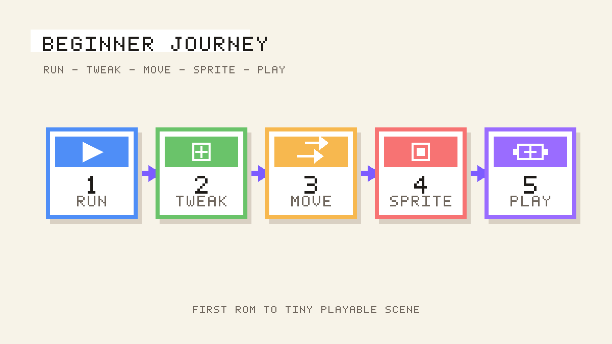

# Understand What Just Happened

## What you are about to achieve

Connect the visible beginner steps you just finished to the core ideas you will keep using in GoSprite64.

## Expected result

By the end of this page, you should be able to point at your tiny playable scene and explain which part came from setup, game logic, drawing, coordinates, and assets.

## What changed

The beginner journey introduced one concept at a time, but all six steps were building the same game structure:

- `Init()` handles setup before the main loop starts. That is where you load assets and set starting values.
- `Update()` handles game logic and input. That is where your sprite moved automatically first, then reacted to button presses.
- `Draw()` handles rendering. That is where the background, sprite, goal, and text appear every frame.
- The fixed canvas gives you stable logical coordinates, so positions like `x = 40` and `y = 80` stay meaningful.
- Embedded assets give your ROM runtime data to load, which is why your sprite could replace the placeholder rectangle.

## Why it matters

You now have a working mental model for how GoSprite64 projects are organized. That makes the next concept pages easier to absorb because they expand ideas you have already seen on screen.

## If this failed

If the recap still feels abstract, reopen the tiny playable scene and map each visible result back to one function:

- starting values and asset loading -> `Init()`
- movement and button handling -> `Update()`
- background, goal, text, and sprite rendering -> `Draw()`

Then read the deeper guides below one at a time instead of all at once.

## Next step

Read [The Game Loop](../04-core-concepts/game-loop.md) first, then continue with:

- [The Fixed Canvas](../04-core-concepts/fixed-canvas.md)
- [D-Pad and Buttons](../06-input/buttons-and-dpad.md)
- [Sprites](../05-graphics/sprites.md)
