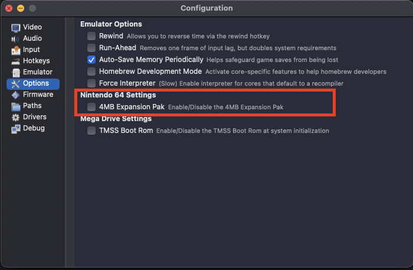

# 🕹️ Running Your Game in an Emulator

Once you've built your `.z64` file using GoSprite64, the next step is to run it!  
If you don’t own a flashcart (yet), no worries—modern N64 emulators work great for testing.

This page walks you through:

- Which emulator we recommend
- How to set it up
- How to load and run your ROM
- Common issues and tips

---

## ✅ Recommended Emulator: [Ares](https://ares-emu.net/)


**Ares** is a modern, accurate, and actively maintained multi-system emulator that includes solid support for the Nintendo 64. It’s fast, cross-platform, and runs `.z64` files generated by GoSprite64 with ease.

### 📦 Download Ares

- [→ Download Ares](https://ares-emu.net/download)

Available for **Windows**, **macOS**, and **Linux**.

Once downloaded, unzip or install it like any other app.

---

## 🚀 Running Your ROM

After you’ve built a GoSprite64 ROM (e.g. `clearscreen.z64`), launch Ares and follow these steps:

1. **Open Ares**
2. Click **System > Nintendo 64**
3. Click **File > Load**
4. Browse to your `.z64` file and select it

That’s it! The emulator will boot your game instantly.  
If the screen stays black or glitches out, don’t panic — just check the **Troubleshooting** section below.

---

## 📁 Where is my `.z64` file?

If you've run `mage Test`, the output file will be located inside:

```plaintext
~/toolchains/nintendo64/gopath/src/gosprite64/examples/clearscreen/
```

Or wherever your current GoSprite64 project lives.

You can move this file somewhere easier to access or keep a “ROMs” folder for testing different builds.

## Expansion Pak simulation

In case you want to simulate a Nintendo64 without the additional 4M of memory, you can configure Ares to do so:



Enabling it you will effectively use 8M of memory, meaning you would have to configure you `build.cfg` in your project accordingly:

```ini
GOTARGET = n64
GOMEM = 0x00000000:8M
GOTEXT = 0x00000400:8M
GOSTRIPFN = 0
GOOUT = z64
```
