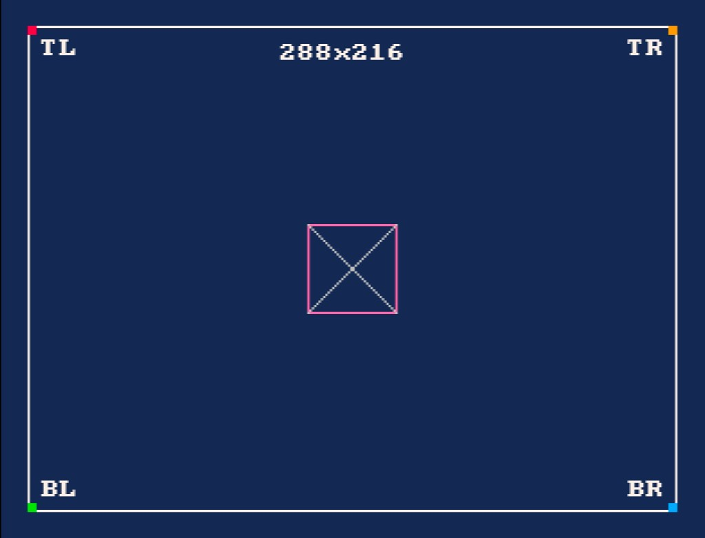

# Getting Started

This repository supports one setup path: build natively with `go1.24.5-embedded` and `n64go@v0.1.2`. If that native bootstrap is unavailable on your host, use the Linux fallback below.

## Installation

1. Clone the repository:

```bash
git clone https://github.com/drpaneas/gosprite64.git
cd gosprite64
```

2. Install the EmbeddedGo toolchain:

```bash
go install github.com/embeddedgo/dl/go1.24.5-embedded@latest
go1.24.5-embedded download
```

3. If macOS aborts with the `__DATA` / `__DWARF` dyld error, retry once with:

```bash
BOOT_GO_LDFLAGS=-w go1.24.5-embedded download
```

4. Install `n64go`:

```bash
go install github.com/clktmr/n64/tools/n64go@v0.1.2
```

5. Build all examples with the supported native-first workflow:

```bash
chmod +x ./build_examples.sh
./build_examples.sh
```

`n64.env` is the only tracked toolchain configuration file:

```bash
GOTOOLCHAIN=go1.24.5-embedded
GOOS=noos
GOARCH=mips64
GOFLAGS='-tags=n64' '-trimpath' '-ldflags=-M=0x00000000:8M -F=0x00000400:8M -stripfn=1'
```

GoSprite64 exposes one official fixed resolution and drawing canvas: `288x216` logical pixels. The runtime centers that canvas and handles presentation scaling for you, so gameplay code should not manage borders, safe areas, or video-mode presets directly.

If you want to verify the fixed-resolution presentation visually, run `examples/calibration/game.z64` in `ares` after the build. The expected calibration frame looks like this:



### Windows

On Windows, install [Git for Windows](https://gitforwindows.org/) and run all commands from a Git Bash terminal. The same steps above apply - Git Bash provides the bash environment the build scripts require.

### Linux Fallback

If the native bootstrap fails on your macOS host, `./build_examples.sh` prints Linux fallback instructions and exits. Run the Linux fallback yourself:

```bash
docker run --rm --platform linux/arm64 \
  -v "$PWD:/workspace/gosprite64" \
  -v gosprite64-gomod:/go/pkg/mod \
  -v gosprite64-gobuild:/root/.cache/go-build \
  -v gosprite64-sdk:/root/sdk \
  -w /workspace/gosprite64 \
  golang:1.26-bookworm \
  bash ./scripts/dev-linux-build.sh
```

The generated `*.z64` ROMs are written under `examples/` and can be run with your emulator, for example `ares`. If you want to verify the square-pixel layout visually, start with `examples/calibration/game.z64`.
