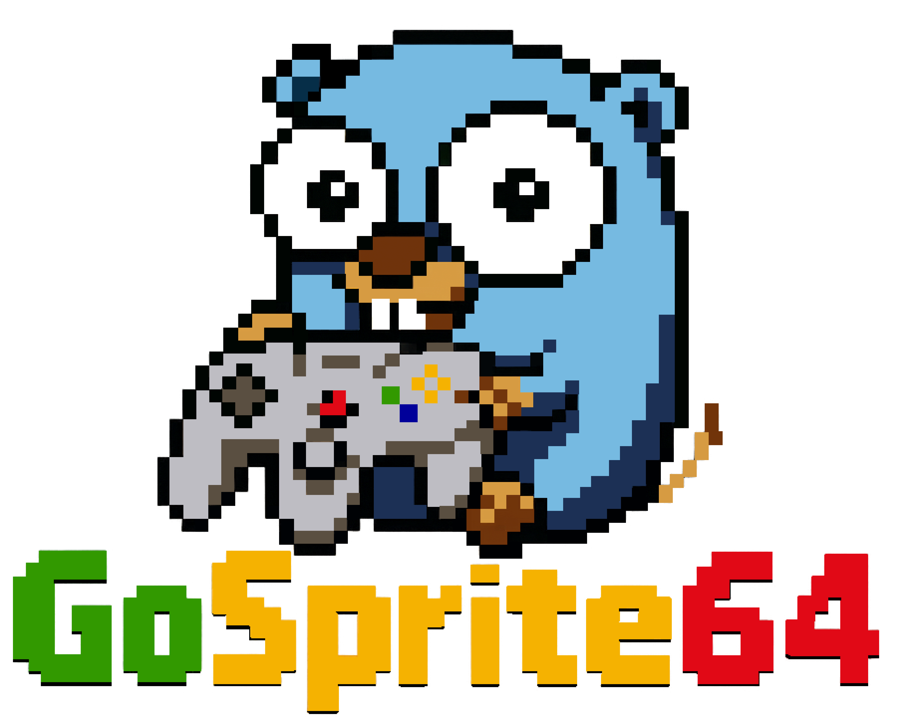

# Introduction

**GoSprite64** is your portal to building retro-fueled 2D games for the **Nintendo 64**, using the modern power of **Go**. With clean APIs, minimal setup (Linux, Mac, Windows are all supported), and a rebellious retro soul, it lets you bring your pixel dreams to life—on real N64 hardware.

> The information here is targeted at homebrew development. This project just got born, expect heavy changes along the way...

## What's GoSprite64?

`GoSprite64` is a Go library for making 2D games that run natively on the Nintendo 64. It wraps low-level N64 quirks in a modern API inspired by modern game engines, so you can focus on your game logic -- not the hardware headaches.

Designed for developers who love Go and grew up on cartridges, GoSprite64 makes retro dev surprisingly fun and productive.

you can:

<!-- * 🧱 Sprite + Tilemap rendering made simple
* 🎮 Full controller support out of the box
* 🔊 Audio playback via the N64’s hardware> -->
* 🚀 A friendly API built on top of `clktmr/n64` and `embedded-go`
* 💾 Builds real N64 ROMs you can flash and play (yes, on real hardware!)

## Why Go?

Go is a clean, fast, pragmatic and efficient language.
By using Go for Nintendo 64 development, `GoSprite64` opens the door for cloud developers to create retro-style games with confidence and speed.  
The library bridges modern programming concepts with the raw power of a classic console.

## What’s in this book?

This book introduces you to GoSprite64, guiding you through everything from setup to building full 2D games.  

You'll learn how to:

* Build and flash N64 ROMs
* Draw and move sprites
* Design and scroll tilemaps
* Handle input
* and more ...

Whether you're nostalgic for the era or just curious about console programming, this book aims to get you productive with GoSprite64 as fast as possible.

## Who is this book for?

This book is for:

* Developers interested in retro console programming
* Go programmers curious about low-level game development
* Hobbyists or indie devs looking to make something fun for the Nintendo 64

Some experience with Go is recommended. If you're brand new to game development or Go, consider starting with a simpler platform or tutorial first.

## Helpful links

* [GoSprite64 GitHub](https://github.com/drpaneas/gosprite64) – main development repo
* [GoSprite64 Website](https://gosprite64.dev) – official docs and examples
* [GoSprite64 Discussions](https://github.com/drpaneas/gosprite64/discussions) – get help, share ideas, or show off your projects
* [clktmr/n64](https://github.com/clktmr/n64) – low-level Go SDK for N64
* [Embedded-Go](https://github.com/embeddedgo/go) – support for N64's architecture
* [Awesome N64 Dev](https://github.com/shiftclock/awesome-n64dev) – great collection of tools, docs, and inspiration

This book also includes step-by-step guides and real-world examples to help you build your own Nintendo 64 games using Go.
