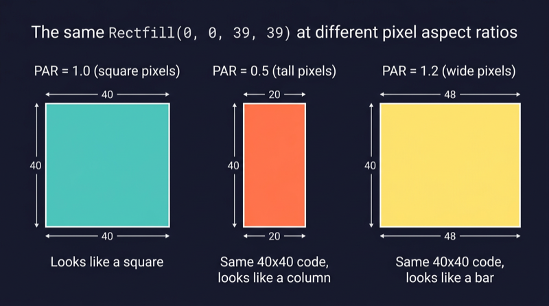
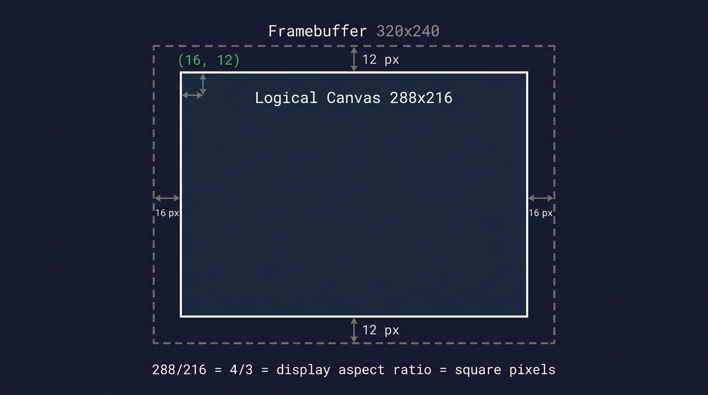
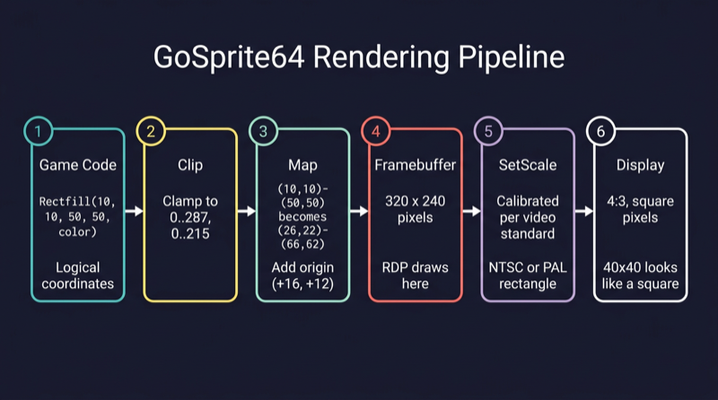

# Square Pixels and the Fixed Canvas

## The problem: my square is a rectangle

When I started building GoSprite64, one of the first things I tried was drawing a square. A simple 40x40 filled rectangle. The code was obvious:

```go
Rectfill(100, 80, 139, 119, Red)
```

That is a 40x40 filled rectangle. It should be a square.

It was not a square. On screen it looked stretched - wider than it was tall, or taller than it was wide, depending on which resolution I was testing with. I changed the resolution constants to compensate, and that fixed it for one video mode but broke it for another. No matter what I tried, I could not get a square to look like a square across both NTSC and PAL without adding aspect-ratio correction math into my game code.

This was driving me nuts. I was writing a 2D game library, not a video-signal processing toolkit. If I draw 40x40 pixels, I want a square on screen. Period.

It took a while to understand why this was happening, and the answer turned out to be surprisingly fundamental. The problem is that pixels are not always square.

## Why this happens - pixels are not always square

### What is a pixel aspect ratio?

Every pixel on a display has a physical shape. On a modern LCD monitor, each pixel is a tiny square element in a fixed grid. One pixel wide equals one pixel tall. But on older displays - particularly CRT televisions, which is what the N64 was designed for - that is not always the case.

The **pixel aspect ratio** (PAR) is the physical width of one pixel divided by its physical height:

```text
PAR = physical width of one pixel / physical height of one pixel
```

- PAR = 1.0 means the pixel is square. A 40x40 rect looks like a square.
- PAR < 1.0 means the pixel is taller than it is wide. A 40x40 rect looks like a tall column.
- PAR > 1.0 means the pixel is wider than it is tall. A 40x40 rect looks like a wide bar.

### The math for 320x240 on NTSC

Let's start with the simplest case. The N64 outputs 320 horizontal pixels and 240 vertical lines. The NTSC television standard displays this signal on a screen with a 4:3 physical aspect ratio.

The **display aspect ratio** (DAR) is the physical shape of the screen:

```text
DAR = 4 / 3 = 1.333
```

The **image aspect ratio** is the shape of the pixel grid itself:

```text
Image AR = 320 / 240 = 4 / 3 = 1.333
```

The pixel aspect ratio is the relationship between these two:

```text
PAR = DAR / Image AR = (4/3) / (320/240) = (4/3) / (4/3) = 1.0
```

The numbers happen to line up perfectly. 320x240 on a 4:3 display gives square pixels. A 40x40 rect looks like a square. Everything is fine.

### What breaks it

The N64's Video Interface is flexible. It can output different horizontal pixel counts: 256, 320, 512, or 640 pixels per line. But the CRT television does not change. It always stretches the signal across the same physical 4:3 screen width.

When you change the horizontal pixel count, each pixel gets wider or narrower. The pixel height stays the same (it is determined by the number of scan lines). So the pixel aspect ratio changes.

Let's work through a concrete example.

### Worked example: 640x240 non-interlaced

Suppose the N64 outputs 640 horizontal pixels and 240 vertical lines (non-interlaced) onto the same 4:3 NTSC display.

```text
Image AR = 640 / 240 = 8 / 3 = 2.667
```

```text
PAR = DAR / Image AR = (4/3) / (8/3) = 4 / 8 = 0.5
```

Each pixel is now half as wide as it is tall. If you draw a 40x40 rectangle in this mode, it has 40 pixels of width but each pixel is only half as wide as it is tall. On screen, it looks like a tall narrow column - not a square.

### PAL makes it worse

PAL televisions use 576 visible lines instead of NTSC's 480. A typical PAL field for the N64 uses 288 visible lines with 320 horizontal pixels.

```text
PAR = (4/3) / (320/288) = (4/3) / (10/9) = (4/3) * (9/10) = 36/30 = 1.2
```

Each pixel is 20% wider than it is tall. A 40x40 rect now looks like a wide, squat bar instead of a square.

### Seeing it visually

Here is the same `Rectfill(0, 0, 39, 39)` call rendered at three different pixel aspect ratios:



The code is identical in all three cases. The pixels just have different physical shapes.

The same pixel coordinates produce different shapes on screen depending on the video mode and the display standard. This is not a bug. It is how analog video works.

## This is normal - it is how analog video works

CRT televisions did not have a fixed pixel grid. There were no tiny square elements arranged in rows and columns. Instead, an electron beam swept across the screen in horizontal lines, painting brightness and color as it went. The horizontal resolution of the image was determined by how fast the signal changed during each sweep - the signal bandwidth - not by a fixed number of physical dots.

The concept of "one pixel equals one square dot" is a modern assumption. It comes from LCD displays, where the screen really is a physical grid of fixed-size rectangular elements. On a CRT, a "pixel" was just one sample point along a scan line, and its effective physical shape depended entirely on how many samples the signal packed into the available screen width.

Early console developers knew this. They designed their sprites with the display's pixel aspect ratio in mind. If they needed a circle to look circular on a PAL television, they drew it as a vertical oval in the pixel grid so the wider PAL pixels would stretch it back into a circle on screen. This was not a workaround. It was standard practice for decades of console and broadcast development.

The N64 is no exception. Its Video Interface was designed to be flexible across NTSC and PAL markets, and that flexibility means the pixel aspect ratio is not fixed. It depends on the video mode configuration.

## The GoSprite64 answer - one canvas, always square

I did not want to think about pixel aspect ratios in my game code. I did not want to adjust my sprites for NTSC versus PAL. I did not want to multiply my X coordinates by a correction factor every time I drew a rectangle.

So I made it the library's problem.

This is my personal preference, and since this is my library, I can make that call. GoSprite64 exposes exactly **one** public coordinate space:

**288 x 216 logical pixels.**

One logical pixel always maps to one square pixel on the final display. No configuration. No presets. No choices. You call `Rectfill(0, 0, 39, 39)` and you get a square on screen. Always.

### Why 288x216 specifically?

The internal framebuffer is 320x240 pixels. That is a hardware-friendly size for the N64. But we do not expose the full 320x240 to game code. Instead, we carve out a centered region:

- 320 - 2 x 16 = 288 pixels wide
- 240 - 2 x 12 = 216 pixels tall

That leaves a 16-pixel border on each side horizontally and a 12-pixel border top and bottom. The remaining canvas has an aspect ratio of:

```text
288 / 216 = 4 / 3
```

That matches the display aspect ratio exactly. Since the framebuffer is presented at the correct physical size for a 4:3 display, and the canvas aspect ratio matches 4:3, each logical pixel in the 288x216 canvas is square.

Here is how the canvas sits inside the framebuffer:



The surrounding 16px/12px borders are the framebuffer gutters. `ClearScreen` fills the entire 320x240 framebuffer, so the gutters take on the clear color. But game drawing APIs are clipped to the inner 288x216 canvas and cannot address the gutters directly.

### Less is more

This is an opinionated library. GoSprite64 is built for people who are learning N64 homebrew development, not for people who already have years of experience with the hardware.

You get one resolution. That is it. There is no `Config` struct, no `VideoPreset` enum, no `LowRes` versus `HighRes` mode selector. You call `Run(&Game{})` and the library sets up the display for you.

Fewer options means less confusion. A newcomer does not need to understand pixel aspect ratios, video interface registers, or interlacing modes to draw a game. They need to know that X goes from 0 to 287, Y goes from 0 to 215, and a square is a square.

If you are already a pro at N64 development and you want raw framebuffer access with multiple video modes, full RDP control, and manual scaling - use [libdragon](https://github.com/DragonMinded/libdragon) in C. It gives you full power and full responsibility. GoSprite64 trades that flexibility for simplicity on purpose.

Here is what the calibration example looks like in the ares emulator:


The white border marks the 288x216 canvas. The corner markers sit at the four logical corners. The center box is a perfect square. The diagonal lines form a symmetric X. If any of those look distorted, something is wrong with the presentation scaling.

## How it works under the hood

Let's trace a single drawing call through the entire rendering pipeline, step by step.



### Step 1: Logical space (288x216)

Your game code calls:

```go
Rectfill(10, 10, 50, 50, Red)
```

These are **logical coordinates**. The game only thinks in terms of the 288x216 canvas. It does not know or care about the framebuffer, the video interface, or the display standard. X=10, Y=10, width=40, height=40. That is a square.

### Step 2: Clipping

The `rendergeom` package checks whether the rectangle fits inside the logical bounds `[0..287, 0..215]`. If any part of the rectangle falls outside those bounds, it is clipped to the edge. If the entire rectangle is outside, it is silently dropped and nothing is drawn.

In our case, `(10,10)-(50,50)` is well within bounds, so it passes through unchanged.

### Step 3: Mapping

The clipped rectangle is offset by the canvas **origin** to place it inside the 320x240 framebuffer. The origin is `(16, 12)` - the top-left corner of the logical canvas in framebuffer space.

```text
Logical:      (10, 10) - (50, 50)
                  + (16, 12)          <- add origin
Framebuffer:  (26, 22) - (66, 62)
```

The logical 40x40 square is now a 40x40 region inside the framebuffer, shifted 16 pixels right and 12 pixels down.

### Step 4: Framebuffer (320x240)

The N64's Reality Display Processor (RDP) draws the filled rectangle at framebuffer coordinates `(26,22)-(66,62)`. At this point it is just colored pixels sitting in a 320x240 memory buffer. Nothing has been sent to the display yet.

### Step 5: Presentation scaling

This is where the square-pixel guarantee is enforced.

When the library initializes the display, it calls `video.SetScale()` with a calibrated rectangle. This rectangle tells the N64 Video Interface exactly how to map the 320x240 framebuffer onto the analog output signal.

The rectangle is different for NTSC and PAL:

- **NTSC:** The 320x240 framebuffer is scaled to fit the visible area of an NTSC signal, centered within the standard 640x480 output window.
- **PAL:** The 320x240 framebuffer is scaled to fit the visible area of a PAL signal, centered within the standard 640x576 output window.

In both cases, the scaling is chosen so that the 288x216 logical canvas - which has a 4:3 aspect ratio - lands on a 4:3 region of the physical display. Since the canvas ratio matches the display ratio, each logical pixel ends up square.

The library detects the video standard at startup and picks the right scaling rectangle automatically. Game code never sees this. It just draws in logical coordinates and the pixels come out square.

### Step 6: On screen

The CRT television or emulator receives the analog signal and paints the image. Because the scaling rectangle was calibrated to make PAR=1.0 for the canvas region, the 40x40 rectangle from step 1 actually looks like a 40x40 square on screen.

That is the whole pipeline. Six steps, fully automatic, and the game developer only ever touches step 1.

## Verify it yourself

The repository includes a calibration example at `examples/calibration` that makes the fixed-resolution presentation easy to verify visually.

Build and run it:

```bash
./build_examples.sh
```

Then open `examples/calibration/game.z64` in an emulator like [ares](https://ares-emu.net/). You should see:

- A white border outlining the full 288x216 canvas
- Corner markers (red, orange, green, blue) at the four logical corners
- The text `288x216` centered at the top
- Labels `TL`, `TR`, `BL`, `BR` near each corner
- A pink square in the center with diagonal lines forming a symmetric X
- A small yellow dot at the exact center of the canvas

If the center box looks like a rectangle instead of a square, or if the diagonal lines look asymmetric, the presentation scaling is off. On a correctly configured emulator or real hardware with the right video standard, everything should look clean and symmetric.

Try it yourself. That is the best way to trust the math.
