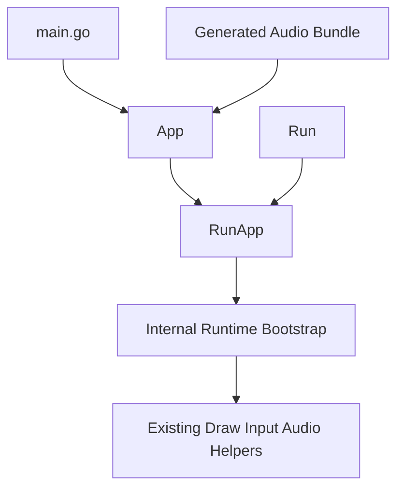

# App Setup API Design

## Goal

Improve GoSprite64 API ergonomics by introducing a small, explicit public setup path that makes startup configuration readable in user code without breaking the current flat gameplay API.

The intended outcome is:

- one obvious place for startup configuration
- less hidden setup through generated registration side effects
- a cleaner path for new projects without forcing rewrites of existing ones
- better setup ergonomics while preserving the current simple gameplay calls

## Context

The recent runtime-boundary refactor clarified internal ownership, but the public setup story still feels more implicit than it should.

Today several parts of startup are spread across different mechanisms:

- games call `Run(g Gamelooper)` directly
- generated audio code registers itself through package-level setup behavior
- runtime defaults such as frame pacing live outside a single public setup surface
- users learn startup by combining docs, generated files, and example patterns

That keeps gameplay calls simple, but it makes startup harder to read in one place.

The problem is not that the library lacks power. The problem is that setup intent is not expressed directly in user code.

## Decision

GoSprite64 will add one small preferred setup API centered on:

- `type App struct { ... }`
- `func RunApp(app App)`

The design direction is:

- keep `Run(g Gamelooper)` as a compatibility wrapper
- make `RunApp` the preferred setup path for new code
- keep `App` small and limited to true startup configuration
- replace generated audio self-registration with explicit public audio bundle values
- preserve the current flat gameplay-facing helper APIs such as drawing, input, and playback calls

This is an ergonomics improvement, not a broad public API rewrite.

Implementation should follow a simplicity-first Go style in the spirit of Ken Thompson, Rob Pike, and Robert Griesemer:

- prefer plain structs and functions over builders or fluent APIs
- keep startup configuration obvious and small
- avoid abstract layers that hide execution order
- choose direct code over flexibility that is not clearly needed
- preserve the flat “just call the helper” feel during gameplay

## Architecture



## Scope

### In scope

- add a small public `App` type for startup configuration
- add a preferred `RunApp(App)` entrypoint
- keep `Run(Gamelooper)` as a compatibility path
- add a public audio bundle representation for generated assets
- update generated audio output to expose explicit bundle data rather than self-registering through side effects
- update at least one real example to demonstrate the new preferred setup path
- add tests for defaults, compatibility, and generated output shape

### Out of scope

- redesigning all gameplay-facing helpers into method receivers
- introducing a builder API or chained configuration DSL
- forcing existing games to migrate off `Run`
- adding many runtime knobs to the public setup surface
- broad naming cleanup across the entire library
- unrelated refactors in rendering, controls, or audio internals

## Public API Shape

### App

The new public setup type should stay intentionally small.

The initial shape should center on:

- `Game Gamelooper`
- `TargetFPS int`
- `Audio *AudioBundle`

Rules:

- `Game` is required
- `TargetFPS == 0` means use the current default behavior
- `Audio == nil` means no runtime audio assets are registered
- fields that are not clearly startup concerns should not be added in this phase

The design explicitly rejects a “configuration bucket” struct that grows without discipline.

### RunApp

`RunApp(app App)` becomes the preferred setup path for new code.

Its responsibilities are:

- validate or normalize startup defaults
- construct and activate the internal runtime
- apply optional audio configuration
- enter the same game loop behavior the library already provides

It should not become a second gameplay abstraction layer. Once startup finishes, existing gameplay helpers remain the way users interact with the library.

### Run compatibility

`Run(g Gamelooper)` stays public and supported.

Its implementation becomes a compatibility wrapper equivalent to:

- `RunApp(App{Game: g})`

That keeps existing programs working while establishing one clear preferred path for new code.

## Audio Bundle Design

The most important ergonomics improvement is replacing generated setup side effects with explicit startup data.

Today generated audio code effectively performs registration for the user. The new design should instead produce a public audio bundle value or constructor that user code passes into `App`.

The bundle should contain only what runtime startup needs:

- manifest or public asset descriptors
- main audio data blob
- auxiliary data blob
- optional name resolver

The bundle should not expose internal engine details.

This changes startup from “generated code did something behind the scenes” to “`main.go` clearly opted into audio”.

## Data Flow

The intended startup flow is:

1. user code builds an `App`
2. optional generated code provides an `AudioBundle`
3. `RunApp` applies defaults such as target FPS
4. `RunApp` creates and activates the runtime
5. `RunApp` injects optional audio bundle data before runtime audio startup
6. gameplay proceeds through the existing helpers and `Gamelooper`

That keeps initialization readable in one place while preserving the current gameplay feel.

## Example User Experience

The target startup style should read like ordinary, explicit Go code.

For a game without generated audio:

```go
func main() {
	gosprite64.RunApp(gosprite64.App{
		Game: &Game{},
	})
}
```

For a game with generated audio:

```go
func main() {
	gosprite64.RunApp(gosprite64.App{
		Game:      &Game{},
		TargetFPS: 60,
		Audio:     &audioBundle,
	})
}
```

The point is not to add ceremony. The point is to make setup visible and unsurprising.

## Compatibility Rules

The compatibility stance is conservative.

- existing `Run` programs continue to work
- existing gameplay helpers remain package-level and unchanged in spirit
- no immediate deprecation of `Run`
- generated audio should support one transition phase where explicit bundle output is added first and self-registration remains available only long enough to avoid breaking existing generated examples in the same implementation cycle

The implementation must choose one clear end state for the phase:

- new and updated examples use explicit `AudioBundle` setup through `App`
- compatibility self-registration, if kept temporarily, is treated as transitional glue rather than the preferred public contract

If compatibility shims are needed during rollout, they should remain thin and temporary rather than becoming a second permanent API story.

## Testing Strategy

Testing should focus on behavior and generated output shape, not broad framework machinery.

### Host-side API tests

Add focused tests for:

- defaulting behavior in `RunApp` input normalization
- `Run` delegating to the same setup path as `RunApp`
- optional audio bundle presence or absence selecting the correct startup behavior

Where target-runtime constraints make direct host tests difficult, extract narrow pure helpers rather than expanding the runtime API.

### Generator tests

Update `cmd/audiogen` tests so generated code is verified to emit:

- an explicit audio bundle value or constructor
- no hidden package-init self-registration as the preferred new path
- stable generated names and package usage expectations

### Example verification

Update at least one example, preferably `examples/pong`, to use the new setup path and keep the example build in CI.

That provides an end-to-end proof that the ergonomics improvement is real, not just conceptual.

## Rollout Order

Implement in this order:

1. define `App`, `AudioBundle`, and `RunApp`
2. route `Run` through the new setup path
3. adapt runtime startup to consume `App` inputs
4. update generated audio output to produce explicit bundle data
5. migrate one example to the new preferred path
6. add focused tests for defaults, compatibility, generator output, and example build behavior

This order keeps the change incremental and avoids mixing setup ergonomics work with unrelated runtime changes.

## Non-Goals For This Phase

Do not expand this work into:

- a chainable builder or option-function API
- a large config struct full of advanced runtime knobs
- converting all existing helpers into methods on `App`, `Runtime`, or `Game`
- a sweeping public API rename campaign
- speculative support for multiple concurrent apps
- hidden compatibility magic that makes startup harder to understand again

The design should not introduce “enterprise” configuration patterns or abstraction layers that conflict with the simplicity goal.

## Final Position

The right next API ergonomics improvement is to add one small, explicit `App` setup surface with a preferred `RunApp` entrypoint, move generated audio integration toward explicit bundle values, keep `Run` as a compatibility wrapper, and preserve the flat gameplay helper style that already makes GoSprite64 pleasant to use once the game is running.
