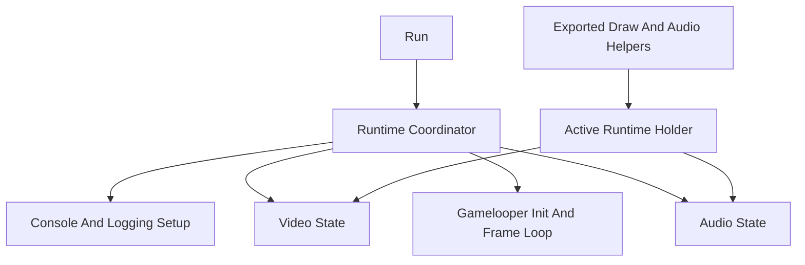

# Core Runtime Boundaries Design

## Goal

Improve maintainability in the core `gosprite64` runtime by making subsystem ownership, startup order, and internal dependencies explicit without making the public API heavier.

The intended outcome is:

- one obvious owner for runtime lifecycle
- clearer internal boundaries between console setup, video, audio, and frame-loop orchestration
- fewer hidden cross-file dependencies through package globals and `init()` side effects
- a refactor that stays focused on maintainability rather than expanding into unrelated feature work

## Context

The current root package is easy to consume but harder to reason about internally.

Today several important behaviors are spread across file-level globals and implicit sequencing:

- `logs.go` performs console and logging bootstrap in `init()`
- `screen.go` owns display state through `currentScreen`
- `audio.go` owns engine, mixer, runtime buffers, and readiness through multiple globals
- `gameloop.go` defines startup order by directly calling setup functions across those files

This shape keeps the public surface simple, but it raises maintainability costs:

- startup behavior is partly hidden in package initialization
- runtime ordering is defined across multiple files instead of one owner
- subsystem state is not grouped by responsibility
- future changes risk introducing more cross-file coupling because there is no single runtime home

The problem to solve is not API complexity for callers. The problem is internal ownership clarity for maintainers.

## Decision

GoSprite64 will keep its lightweight public API, but internally it will introduce one runtime owner that coordinates subsystem setup and holds the active runtime state.

The design direction is:

- keep `Run()` as the public entrypoint
- move console and logging bootstrap out of package `init()` and into explicit runtime setup
- group video state behind one runtime-owned video unit
- group audio state behind one runtime-owned audio unit
- let exported helper functions delegate through an internal active-runtime holder instead of reaching into subsystem globals directly

This is an internal boundary cleanup, not a public API redesign.

The active-runtime holder is an internal singleton to preserve current package-level ergonomics. This design does not introduce public multi-runtime support.

Implementation should follow a simplicity-first Go style in the spirit of Ken Thompson, Rob Pike, and Robert Griesemer:

- prefer obvious control flow over clever abstractions
- keep functions and types small when possible
- avoid indirection that hides data ownership or runtime behavior
- choose direct code that is easy to read, explain, and modify later
- reject speculative flexibility that is not required by this refactor

## Architecture

## Scope

### In scope

- introduce an internal runtime owner for core lifecycle
- make console setup explicit rather than package-init driven
- group screen-related state and helpers around one internal owner
- group audio-related state and helpers around one internal owner
- preserve current startup behavior where it is already intentional
- create narrow seams that allow targeted runtime-sequencing tests

### Out of scope

- redesigning the public game API around user-managed runtime objects
- changing gameplay-facing draw helper semantics
- changing the public audio API shape unless needed for consistency
- broad package splits across the whole repository
- unrelated refactors in examples, docs, tooling, or rendering math
- speculative shutdown, hot-reload, or multi-runtime support

## Subsystem Boundaries

### Runtime coordinator

The runtime coordinator is the single internal owner of startup sequencing and active subsystem references.

Its responsibilities are:

- initialize subsystems in the correct order
- hold the active video and audio state
- define the frame-loop lifecycle
- expose narrow internal access points for exported facade helpers

It should not absorb rendering math, mixing logic, or game-specific behavior. Its job is orchestration, not implementation of every subsystem detail.

### Console and logging setup

Console bootstrap should move out of `init()` and become an explicit setup step invoked by the runtime coordinator.

That setup continues to:

- probe the cart
- mount `/dev/console` when available
- wire `stdout`, `stderr`, and the standard logger

The maintainability gain is that startup side effects become visible in one lifecycle path instead of happening during package load.

### Video state

Video state should own:

- display creation
- framebuffer swap state
- bounds and presentation configuration
- draw-time helpers that require active framebuffer access

This keeps screen lifecycle and drawing prerequisites together. Exported drawing helpers can remain top-level functions, but they should resolve the active video state through the runtime owner rather than through an unrelated package global.

### Audio state

Audio state should own:

- pre-run audio configuration that must survive into runtime startup
- manifest registration state
- engine and mixer instances
- feeder-loop buffers and per-voice runtime tracking
- ready-state transitions and command submission path

This refactor does not need to redesign the audio feature set. It only needs to make audio ownership clear and keep related state together.

Public registration functions such as audio asset registration may remain package-level if needed, but their state should feed one clearly owned audio unit instead of a loose collection of globals.

### Exported facade helpers

Gameplay-facing helpers such as drawing and audio playback can stay lightweight and package-level.

Their internal rule changes to:

- resolve the active runtime
- delegate to the correct subsystem owner
- preserve current no-op behavior when the relevant subsystem is not ready

This preserves ease of use while reducing coupling to scattered globals.

## Runtime Flow

The runtime owner must make startup order explicit and linear.

The intended flow is:

1. configure console and logging
2. initialize video state
3. call `g.Init()`
4. initialize audio state
5. enter the frame loop

This preserves the current useful behavior in which audio calls made before audio startup are harmless no-ops.

The frame loop remains responsible for:

- controller updates
- game update cadence
- drawing
- frame pacing

The difference is that subsystem readiness and ownership are explicit in runtime structure rather than inferred from package-level variables.

## Error Handling

This maintainability refactor should not introduce a broad new public error model unless a concrete need emerges during implementation.

The error-handling objective is simpler:

- centralize setup decisions in one place
- keep existing fail-fast behavior where startup cannot continue safely
- keep intentional soft-failure behavior where subsystem calls should be harmless no-ops
- ensure each setup failure path has one obvious owner

For example:

- console mount or file-open failures remain startup concerns owned by runtime bootstrap
- draw calls before video readiness remain guarded by the video subsystem
- playback calls before audio readiness remain guarded by the audio subsystem

## Testing Strategy

The testing goal is not to blanket the refactor with low-value tests. The goal is to create meaningful seams around lifecycle rules.

### Add focused tests where boundaries become testable

Prefer narrow tests for:

- runtime setup ordering rules
- not-ready behavior for delegated helpers
- subsystem state transitions that are currently only implied by globals

### Keep lower-level subsystem tests where they already exist

Existing audio-internal tests should continue to carry the detailed verification burden for mixing, decoding, and source behavior.

The new runtime-boundary tests should verify orchestration and ownership, not re-test audio algorithms.

### Prefer host-testable seams

Where possible, extract or structure logic so lifecycle decisions can be exercised without requiring full target runtime execution.

That gives maintainers confidence in the refactor without tying every check to ROM builds or manual device behavior.

## Rollout Order

Implement in this order:

1. define the internal runtime owner and active-runtime access pattern
2. move console and logging bootstrap out of `init()` into runtime setup
3. group video state under runtime ownership without changing draw semantics
4. group audio state under runtime ownership without changing playback semantics
5. update top-level helper functions to delegate through runtime-owned subsystems
6. add focused tests around runtime sequencing and not-ready behavior

This order keeps the refactor incremental and reduces the chance of mixing structural cleanup with behavior changes.

## Non-Goals For This Phase

Do not expand this work into:

- a public runtime-builder or dependency-injection API
- support for multiple active runtimes
- shutdown lifecycle design unless it is required by the refactor
- broad renaming for style alone
- unrelated cleanup in examples, docs, geometry helpers, or rendering model code
- performance tuning presented as maintainability work

The refactor should not introduce "enterprise" structure, ornamental interfaces, or abstraction layers that conflict with the simplicity goal above.

## Final Position

The right maintainability improvement is to keep GoSprite64 simple on the outside while introducing one explicit internal runtime owner that defines startup order, groups subsystem state by responsibility, removes hidden package-init behavior, and gives future changes a clear home instead of adding more global cross-file coupling.
